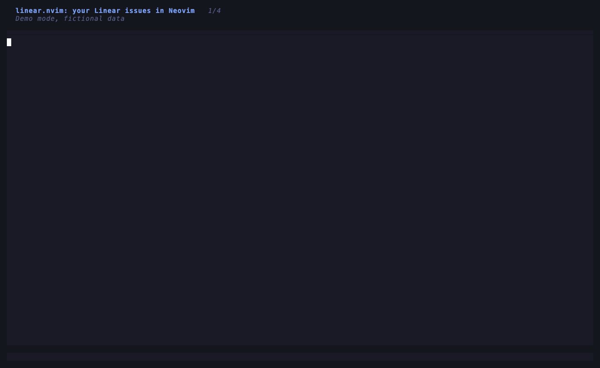
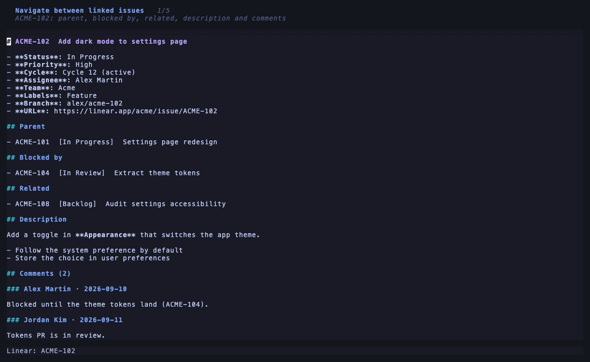
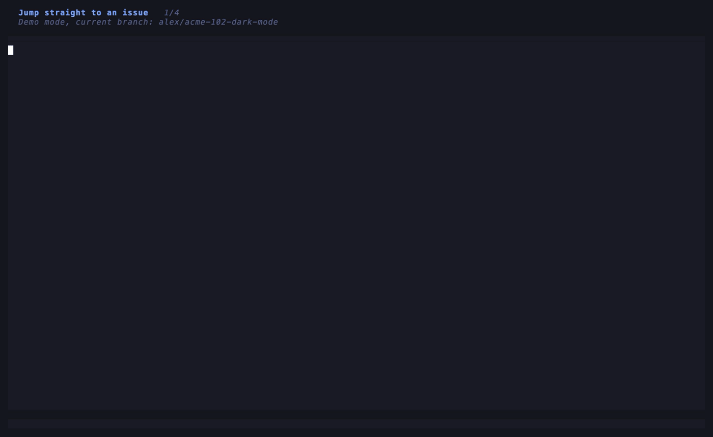

# linear.nvim

Browse your [Linear](https://linear.app) issues from Neovim: issues sorted by cycle (sprint), full issue view (status, priority, labels, description, comments) and navigation through parent, sub-issues, blocking / blocked-by, related and duplicate issues.

**Your issues by sprint.** Active cycle first, then next, older and no cycle, with the current git branch's issue pinned on top. The preview shows the full issue. The GIFs use demo mode, with fictional data.



**Navigate between linked issues.** Parent, sub-issues, blocked by / blocks, related and duplicates: follow any link with Enter and come back with Backspace.



**Jump straight to an issue.** Open any issue by its id, or the one named in the current git branch.



## Features

- Your assigned issues sorted by cycle: active, next, older, then no cycle, with the current git branch's issue pinned on top
- Full issue in the picker preview: status, priority, labels, description, comments, links
- Issue buffer with parent, sub-issues, blocked by / blocks, related and duplicate issues
- Jump between linked issues and back, like tags
- Open the issue of the current git branch (`alex/eng-123-fix-login` → `ENG-123`)
- One-command login, key stored in your OS keychain
- Demo mode with fictional data to try it without an account

Works with any Neovim >= 0.10 configuration and plugin manager. Uses the [snacks.nvim](https://github.com/folke/snacks.nvim) picker when available, and falls back to `vim.ui.select` without it.

## Requirements

- Neovim >= 0.10
- `curl`
- Optional, recommended: [snacks.nvim](https://github.com/folke/snacks.nvim) for the picker preview (already part of LazyVim)
- Optional: macOS Keychain (built in) or `secret-tool` (libsecret) on Linux to store your key

## Installation

<details open>
<summary><b>LazyVim</b></summary>

Create `lua/plugins/linear.lua`. snacks.nvim is already part of LazyVim. `<leader>l` is taken by Lazy, so the keymaps live under `<leader>i`.

```lua
return {
  "Antoine-Regembal/linear.nvim",
  version = "*",
  cmd = "Linear",
  keys = {
    { "<leader>ii", "<cmd>Linear issues<cr>", desc = "Linear: My issues" },
    { "<leader>ic", "<cmd>Linear cycle<cr>", desc = "Linear: Active cycle" },
    { "<leader>io", "<cmd>Linear open<cr>", desc = "Linear: Open issue by id" },
    { "<leader>ib", "<cmd>Linear branch<cr>", desc = "Linear: Issue of current branch" },
  },
  opts = {},
}
```

</details>

<details>
<summary><b>lazy.nvim</b></summary>

```lua
{
  "Antoine-Regembal/linear.nvim",
  version = "*",
  dependencies = { "folke/snacks.nvim" },
  opts = {},
}
```

</details>

<details>
<summary><b>vim.pack</b> (built in, Neovim >= 0.12)</summary>

```lua
vim.pack.add({
  "https://github.com/folke/snacks.nvim",
  { src = "https://github.com/Antoine-Regembal/linear.nvim", version = vim.version.range("0.1") },
})
require("linear").setup()
```

</details>

<details>
<summary><b>mini.deps</b></summary>

```lua
MiniDeps.add({
  source = "Antoine-Regembal/linear.nvim",
  checkout = "v0.1.0",
  depends = { "folke/snacks.nvim" },
})
require("linear").setup()
```

</details>

<details>
<summary><b>vim-plug</b></summary>

```vim
Plug 'folke/snacks.nvim'
Plug 'Antoine-Regembal/linear.nvim', { 'tag': 'v0.1.0' }

" after plug#end()
lua require("linear").setup()
```

</details>

<details>
<summary><b>packer.nvim</b> (unmaintained since 2023)</summary>

```lua
use({
  "Antoine-Regembal/linear.nvim",
  tag = "v0.1.0",
  requires = { "folke/snacks.nvim" },
  config = function()
    require("linear").setup()
  end,
})
```

</details>

snacks.nvim is recommended but optional: without it, pickers fall back to `vim.ui.select` (no preview). `:Linear` is available as soon as the plugin is loaded. `setup()` is only needed for the `<leader>i` keymaps and the [options](#configuration).

Then log in once:

```vim
:Linear login
```

It opens Linear's API key page, asks for the key (hidden input), checks it against the API and stores it in your OS keychain. That's it: `:Linear issues`.

## Try it without an account

```vim
:Linear demo
```

Demo mode serves a fictional `ACME` team from local data: no API key, no network calls to Linear. `:Linear demo off` leaves it. Start in demo mode with `opts = { demo = true }`.

## Commands

| Command | Description |
| --- | --- |
| `:Linear issues` | Your assigned issues, active cycle first, then next, older cycles, no cycle. The issue of the current git branch is pinned on top (marked `git`), even when it is not assigned to you. The preview shows the full issue (description, comments, links) |
| `:Linear cycle` | Your issues in the active cycle |
| `:Linear open [ID]` | Open an issue (`ENG-123`), prompts with the id under the cursor |
| `:Linear branch` | Open the issue whose id is in the current git branch name, case-insensitive (`alex/eng-123-fix-login`, `ENG-123`, `feature/ENG-123`) |
| `:Linear login` / `logout` / `whoami` | Manage the API key |
| `:Linear demo [off]` | Fictional data, no account needed |

## Keymaps

Global keymaps use `opts.prefix` (default `<leader>i`; `<leader>l` is taken by Lazy in LazyVim). Check it is free with `:map <leader>i`, or pick another one, or set `prefix = false` and use the `keys` spec above.

| Key | Action |
| --- | --- |
| `<prefix>i` | My issues |
| `<prefix>c` | Active cycle |
| `<prefix>o` | Open issue by id |
| `<prefix>b` | Issue of current branch |
| `<prefix>l` / `<prefix>L` | Login / logout |

Inside an issue buffer:

| Key | Action |
| --- | --- |
| `<CR>` / `gd` | Open the issue on the cursor line |
| `<BS>` | Back to the previous issue |
| `gp` | Open the parent issue |
| `gr` | Pick among parent, sub-issues and linked issues |
| `gx` | Open in the browser |
| `yy` | Copy the issue identifier |
| `R` | Refresh |
| `q` | Close |

## Configuration

```lua
opts = {
  prefix = "<leader>i",      -- false to disable global keymaps
  cache_ttl = 60,            -- seconds an issue stays cached
  include_completed = false, -- show completed/canceled issues
  max_issues = 100,
  pin_branch_issue = true,   -- pin the current git branch issue on top of the pickers
  demo = false,              -- start in demo mode
}
```

## Security

- The key is read from `LINEAR_API_KEY` if set, otherwise from the OS keychain (macOS Keychain, libsecret). Without a keychain it falls back to `stdpath("data")/linear.nvim/credentials.json` with `0600` permissions (`:checkhealth linear` warns about it).
- The key is sent only to `https://api.linear.app/graphql`, through curl's stdin so it never appears in the process list, and is never printed.
- On macOS, `security add-generic-password` receives the key as an argument during `:Linear login`, so it is briefly visible to local processes at that moment.
- Prefer a **read-only** key restricted to the teams you need: the plugin never writes to Linear. Revoke it any time from Linear's settings and run `:Linear logout`.

## Health

```vim
:checkhealth linear
```

## Development

```sh
nvim --headless -l tests/run.lua
nvim --headless --clean -l tests/view.lua
nvim --headless --clean -l tests/preview.lua
nvim --headless --clean -l tests/demo.lua
```

The GIFs are generated from demo mode with [VHS](https://github.com/charmbracelet/vhs) (`brew install vhs`):

```sh
vhs assets/issues.tape
vhs assets/navigate.tape
vhs assets/branch.tape
```

## License

MIT
